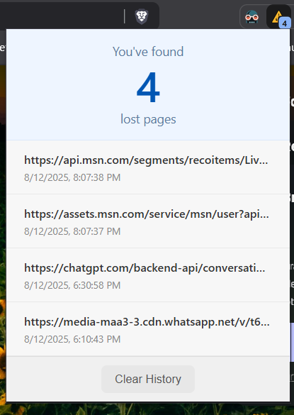

# 404 Extension

A little companion for your travels across the web.

Ever wonder how often you land on a "Page Not Found" page? We all end up in the internet's dead ends from time to time. This simple extension was born out of that curiosity. A small tool to keep a friendly count of those little 404 bumps along the road.

It's not meant to be a big, important tool. It's just a small, quiet counter for anyone who's a little curious about their journey online.

## A Few Simple Things It Does

* **A Gentle Counter:** It quietly keeps track whenever you visit a 404 page. No loud noises or popups, just a simple count.
* **A Quiet Nudge:** The number of lost pages you've found is shown right on the extension's icon, just as a little reminder of your travels.
* **A Fresh Start:** If you ever want to start over, a simple click on the "Reset" button in the popup will set your count back to zero.
* **It Remembers for You:** The count is saved on your computer, so you can close your browser and pick up right where you left off.

## Here’s How It Looks

It's designed to be simple and out of your way.

**The simple popup with your current count:**


**The little number on the icon in your toolbar:**


## Want to Try It?

If you'd like to add this to your browser, it's just a few simple steps.

#### 1. Get the Code

You can get the code in one of two ways.

If you're comfortable with Git, you can copy the project with:
```bash
git clone "https://github.com/TimsTittus/404-Counter/"
```
## Add it to Chrome
* Open Chrome and head to chrome://extensions.

* In the top-right corner, find the Developer mode switch and turn it on.

* A few new buttons will show up. Click on Load unpacked.

* In the window that opens, find and select the 404-counter folder.

* And that's it! You should see the little icon pop up in your toolbar, ready for your next Browse session.